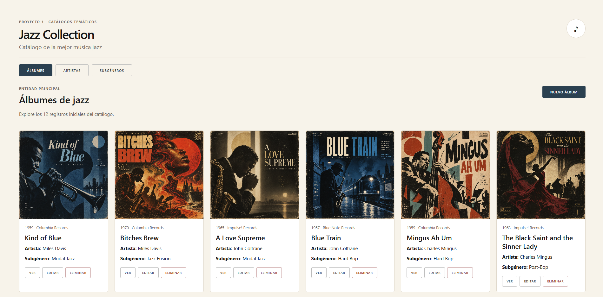

# 🎷 Jazz Collection

[](https://vuejs.org/)
[](https://vite.dev/)
[](https://workers.cloudflare.com/)
[](https://developers.cloudflare.com/d1/)
[](#-api-rest)
[](./docs/openapi.yaml)
[](https://developer.mozilla.org/docs/Web/JavaScript)
[](https://jazz.jazz-collection-una.workers.dev)
[](https://jazz.jazz-collection-una.workers.dev)

Aplicación web académica para explorar y administrar un **catálogo de música jazz**, desarrollada con **Vue.js**, una **API REST en Cloudflare Workers** y una base de datos **Cloudflare D1**.

> **Aplicación publicada:** https://jazz.collection-una.workers.dev

## Vista previa



## 📌 Descripción

**Jazz Collection** administra tres entidades relacionadas:

- **Álbumes** — entidad principal.
- **Artistas** — entidad secundaria.
- **Subgéneros** — entidad secundaria.

El sistema permite listar, consultar, crear, editar y eliminar registros, además de navegar entre las relaciones del catálogo.

---

## ✨ Funcionalidades

- Listado de los **12 álbumes** iniciales.
- Listado de **6 artistas**.
- Listado de **6 subgéneros**.
- Consulta individual de cada registro.
- Creación, edición y eliminación.
- Navegación entre álbum, artista y subgénero.
- Imágenes para las tres entidades.
- API REST ejecutada como FaaS en Cloudflare Workers.
- Persistencia de datos con Cloudflare D1.
- Documentación mediante OpenAPI 3.0.3.
- Diseño simple, adaptable y de ancho completo.

---

## 🧩 Modelo de datos

```text
ARTISTS
   1
   │
   │ artist_id
   │
   N
ALBUMS
   N
   │
   │ subgenre_id
   │
   1
SUBGENRES
```

### Cantidad de registros iniciales

| Entidad | Cantidad |
|---|---:|
| Álbumes | 12 |
| Artistas | 6 |
| Subgéneros | 6 |

---

## 🛠️ Tecnologías

| Tecnología | Uso |
|---|---|
| Vue.js | Frontend |
| Vue Router | Navegación |
| Vite | Desarrollo y compilación |
| JavaScript | Cliente y Worker |
| Fetch API | Consumo del servicio REST |
| Cloudflare Workers | Backend / FaaS |
| Cloudflare D1 | Base de datos SQLite |
| SQL | Esquema y carga inicial |
| OpenAPI 3.0.3 | Documentación |
| Normalize.css | Normalización de estilos |
| Skeleton CSS | Base visual |
| Git / GitHub | Control de versiones |

---

## 📁 Estructura principal

```text
jazz-collection/
├── data/
│   ├── albums.json
│   ├── artists.json
│   └── subgenres.json
├── docs/
│   └── openapi.yaml
├── public/
│   └── images/
│       ├── albums/
│       ├── artists/
│       └── subgenres/
├── src/
│   ├── album/
│   │   ├── Index.vue
│   │   └── Details.vue
│   ├── artist/
│   │   ├── Index.vue
│   │   └── Details.vue
│   ├── subgenre/
│   │   ├── Index.vue
│   │   └── Details.vue
│   ├── css/
│   ├── App.vue
│   └── main.js
├── worker/
│   └── index.js
├── schema.sql
├── wrangler.jsonc
├── vite.config.js
├── package.json
└── README.md
```

---

## 🚀 Instalación y ejecución local

Clonar el repositorio:

```bash
git clone https://github.com/AndreaCarrilloOp/jazz-collection.git
cd jazz-collection
```

Instalar dependencias:

```bash
npm install
```

Ejecutar el frontend durante desarrollo:

```bash
npm run dev
```

Compilar para producción:

```bash
npm run build
```

Ejecutar la aplicación completa con Worker + D1 local:

```bash
npx wrangler dev
```

---

## 🗄️ Cloudflare D1

Base de datos:

```text
catalogo-jazz-db
```

Binding utilizado por el Worker:

```text
DB
```

El Worker accede a D1 mediante:

```js
env.DB
```

Para cargar el esquema en la base remota:

```bash
npx wrangler d1 execute DB --remote --file=./schema.sql
```

---

## 🔌 API REST

### Álbumes

```http
GET    /api/albums
GET    /api/albums/:id
POST   /api/albums
PUT    /api/albums/:id
DELETE /api/albums/:id
```

### Artistas

```http
GET    /api/artists
GET    /api/artists/:id
POST   /api/artists
PUT    /api/artists/:id
DELETE /api/artists/:id
```

### Subgéneros

```http
GET    /api/subgenres
GET    /api/subgenres/:id
POST   /api/subgenres
PUT    /api/subgenres/:id
DELETE /api/subgenres/:id
```

### Producción

Ejemplo:

```text
https://jazz.collection-una.workers.dev/api/albums
```

---

## 📖 OpenAPI

La especificación se encuentra en:

```text
docs/openapi.yaml
```

Servidor de producción:

```yaml
servers:
  - url: https://jazz.collection-una.workers.dev
```

---

## ☁️ Despliegue

El proyecto se encuentra desplegado en **Cloudflare Workers**.

```text
https://jazz.collection-una.workers.dev
```

Comandos utilizados:

```bash
npm run build
npx wrangler deploy
```

El despliegue publicado tiene acceso a:

```text
env.DB      → catalogo-jazz-db
env.ASSETS  → Assets
```

---

## 🎓 Contexto académico

Proyecto desarrollado con fines académicos y alineado con los contenidos vistos en clase:

- Node.js y recursos web.
- Servicios REST.
- Métodos GET, POST, PUT y DELETE.
- OpenAPI.
- Vue.js.
- Funciones como servicio (FaaS).
- Cloudflare Workers.
- Cloudflare D1.
